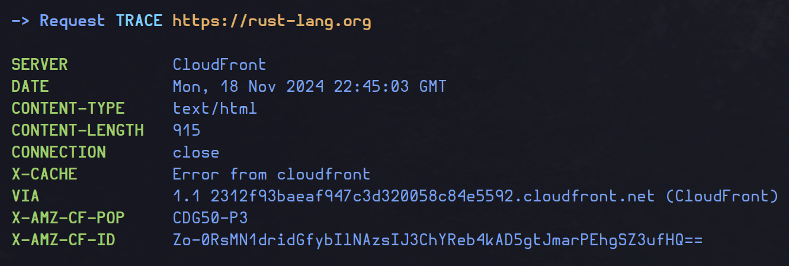

# headers

Here is my first App made in `Rust`, it's just a basic `CLI tool` to make a `GET` request to a `URL` and print the headers contained in the response.
Of course, you could use `cURL` to do that, but I just wanted to make a somewhat useful simple app with `Rust`,
instead of making an App that gives the mean of a list of numbers or greets a user, or whatever useless Apps we commonly make to learn a language...

So, pretty simple, you run it indicating the `URL` as argument, and it should give you the headers: simple and stupid.

Here are some examples:

- `headers -T rust-lang.com`:

    

- `headers -h`:

    

Enjoy!

Antoine de Barbarin
